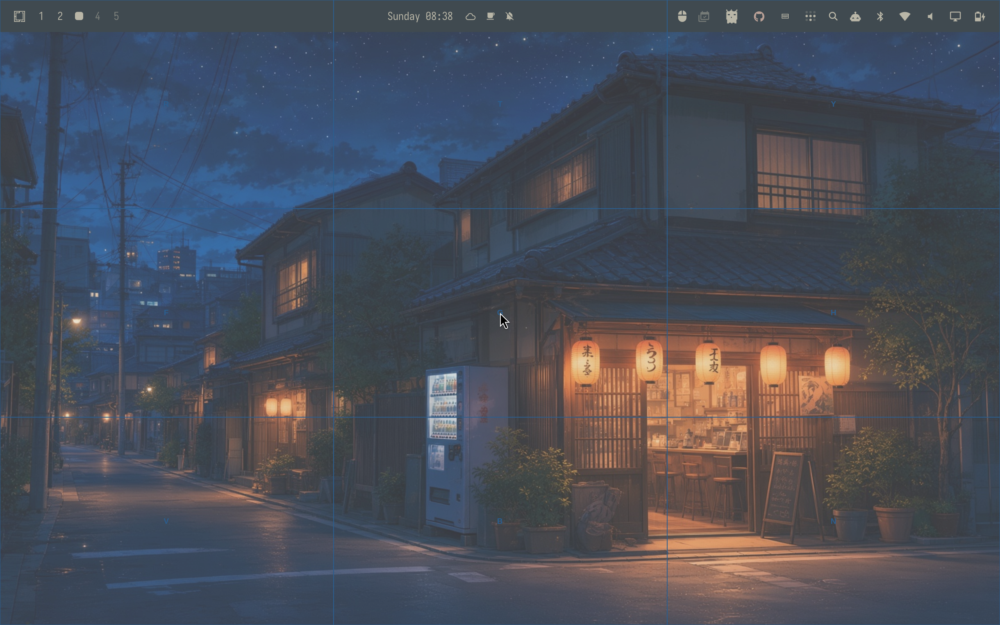
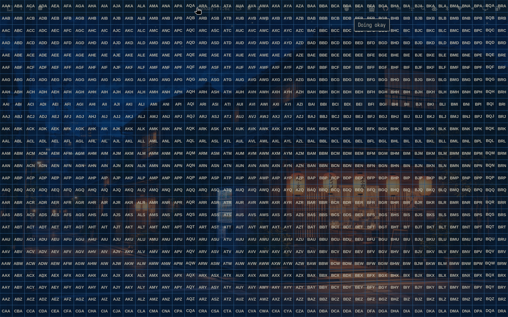

# Homearchy

Keyboard-driven navigation for [Omarchy](https://omarchy.org). Homearchy adds screen-wide hints, search, grid navigation, recursive grid navigation, vim-style scrolling, monitor selection (alpha), and an optional Omarchy bar widget.

Click the bar icon to open every mode, including how to configure hotkeys. Grid covers the whole screen with typeable cells. Recursive grid starts coarser, then zooms into the cell you type.






## Requirements

- Omarchy 4.0 or newer
- Hyprland on Wayland
- `amd64` or `arm64` Linux

Homearchy bundles its own engine for both supported architectures. It does not use or require an installed Neru binary or service.

## Install

```bash
omarchy plugin add https://github.com/inde3d100/homearchy --enable
~/.config/omarchy/plugins/io.github.inde3d100.homearchy/bin/homearchy-setup
```

The setup command edits `~/.config/hypr/bindings.lua`, preserves a one-time `.pre-homearchy` backup, reloads Hyprland, and restores the original file if Hyprland reports a configuration error. Running it again is a no-op.

The plugin starts and supervises the engine through Omarchy Shell. No separate systemd unit is installed.

## Shortcuts

`homearchy-setup` installs these Hyprland chords. They use `Super+Shift` letter keys so they do not replace stock Omarchy bindings such as `Super+Enter` (terminal), `Super+J` (toggle split), `Super+Escape` (system menu), `Super+Shift+D` (Docker), or `Super+Ctrl+Z` (zoom).

| Shortcut | Action |
|---|---|
| `Super+Shift+H` | Hints |
| `Super+Shift+U` | Searchable hints |
| `Super+Shift+J` | Grid |
| `Super+Shift+R` | Recursive grid |
| `Super+Shift+Z` | Scroll mode |
| `Super+Shift+I` | Monitor selection (alpha) |
| `Super+Shift+Escape` | Cancel overlay / return to idle |

The shortcuts are configurable. Open **Configure hotkeys** from the bar menu, or edit the managed Homearchy block in `~/.config/hypr/bindings.lua`, then reload Hyprland with `hyprctl reload`. Keep the `[hotkeys]` table in `Service.qml` `generatedConfig()` on the same chords and restart the plugin so the engine matches:

```bash
omarchy-shell io.github.inde3d100.homearchy restart
```

Hints, searchable hints, grid, and recursive grid left-click the final selection automatically. In grid and recursive grid, type the cell letters to zoom, then `Space` to left-click or `Enter` to right-click the current cell. Overlay `Enter` is not `Super+Enter` (Omarchy's open-terminal chord). Press `Escape` or `Super+Shift+Escape` to cancel without clicking. Those overlay keys are generated by the plugin service, not by `bindings.lua`.

Hints label buttons and fields in the focused window. They need that window to speak AT-SPI; Chromium, Firefox, GTK, and Qt apps usually do. If Super+Shift+H or Super+Shift+U appear to do nothing, the shortcut fired but no labels were found — try a Chromium or terminal window, then `homearchy doctor`.

Scroll mode uses vim keys with Omarchy's inverted wheel: `j` down, `k` up, `h` left, `l` right. The grid and recursive-grid shortcuts still work from scroll: they switch modes without Escape first.

Monitor selection is **alpha**. It has not been exercised on a multi-monitor Hyprland session. With one display the mode is a no-op.

Remove only Homearchy's managed bindings with:

```bash
~/.config/omarchy/plugins/io.github.inde3d100.homearchy/bin/homearchy-setup --remove
```

## Bar widget

The widget shows engine health and the active navigation mode. Click it to open controls for every mode, read how to configure hotkeys, or restart the engine. Middle-click starts hints directly.

Move it with Omarchy's bar command:

```bash
omarchy bar move io.github.inde3d100.homearchy --section right
```

The engine palette follows the active Omarchy theme. Theme changes are written to `~/.local/state/homearchy/plugin.toml` and reloaded by the running engine.

## CLI

The architecture dispatcher is inside the installed plugin:

```bash
HOMEARCHY="$HOME/.config/omarchy/plugins/io.github.inde3d100.homearchy/bin/homearchy"
"$HOMEARCHY" status --json
"$HOMEARCHY" hints
"$HOMEARCHY" hints --search
"$HOMEARCHY" grid
"$HOMEARCHY" recursive_grid
"$HOMEARCHY" scroll
"$HOMEARCHY" monitor_select
"$HOMEARCHY" idle
```

Omarchy Shell exposes the service status separately:

```bash
omarchy-shell io.github.inde3d100.homearchy status
```

The service status schema is versioned. Version 1 returns `state`, `mode`, `version`, `enabled`, `ready`, and `error`.

## Update or remove

```bash
omarchy plugin update io.github.inde3d100.homearchy
omarchy plugin remove io.github.inde3d100.homearchy --yes
```

Remove the managed shortcuts before removing the plugin if you no longer want them:

```bash
~/.config/omarchy/plugins/io.github.inde3d100.homearchy/bin/homearchy-setup --remove
```

## Verify a checkout

```bash
omarchy plugin validate .
(cd bin && sha256sum -c SHA256SUMS)
```

Release builds run natively on Ubuntu runners for `amd64` and `arm64`, smoke-test each engine, publish SHA-256 checksums, and create GitHub build-provenance attestations. `scripts/build-linux-engine.sh` intentionally requires a native runner for the target architecture.

## Troubleshooting

```bash
# Engine and backend status
~/.config/omarchy/plugins/io.github.inde3d100.homearchy/bin/homearchy status --json
~/.config/omarchy/plugins/io.github.inde3d100.homearchy/bin/homearchy doctor

# Plugin state
omarchy plugin list --json
omarchy-shell io.github.inde3d100.homearchy status

# Hyprland binding errors
hyprctl configerrors

# Reload plugin code
omarchy-shell shell rescanPlugins
```

Homearchy and Neru use separate sockets, config directories, logs, and service names. Do not run both navigation daemons at the same time because both can capture keyboard and pointer input.

## Development

Go 1.26.6 is required. Linux builds also need Cairo, Wayland, X11/XTest, xkbcommon, libei, oeffis, Tesseract, and PipeWire development packages.

```bash
go test ./internal/cli ./internal/app/ipcctrl ./internal/adapter/platform
scripts/build-linux-engine.sh arm64   # or amd64 on a native amd64 host
omarchy plugin validate .
```

The engine is derived from [Neru](https://github.com/y3owk1n/neru). Upstream copyright and license terms remain in [LICENSE](LICENSE).

## License

MIT. Copyright 2024 Neru Contributors and 2026 inde3d100.
